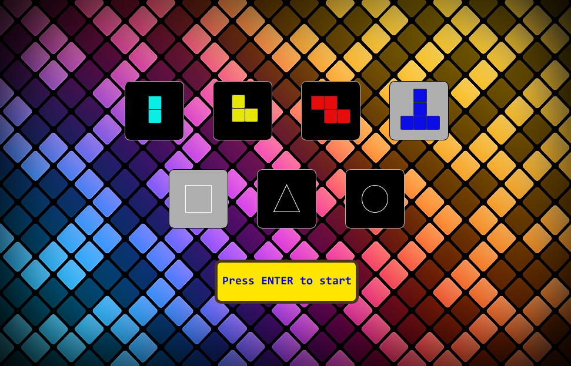
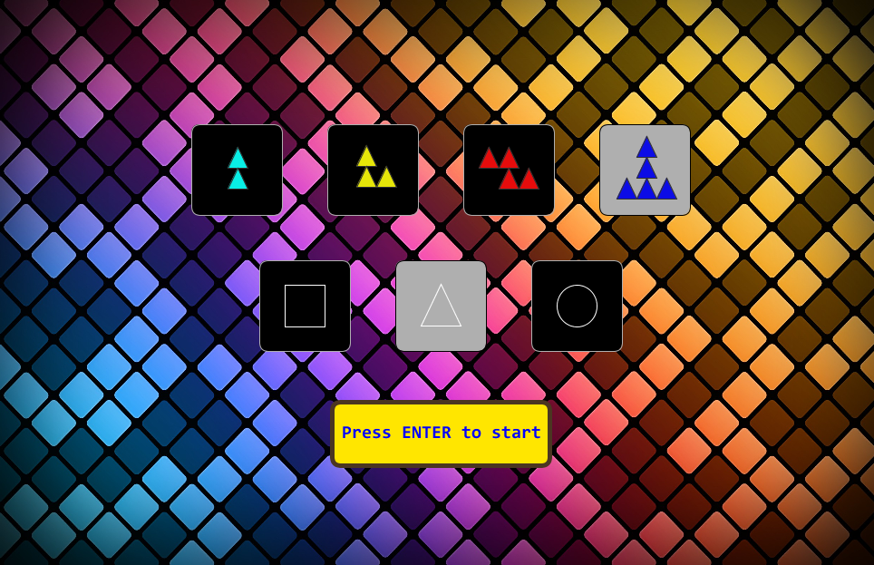
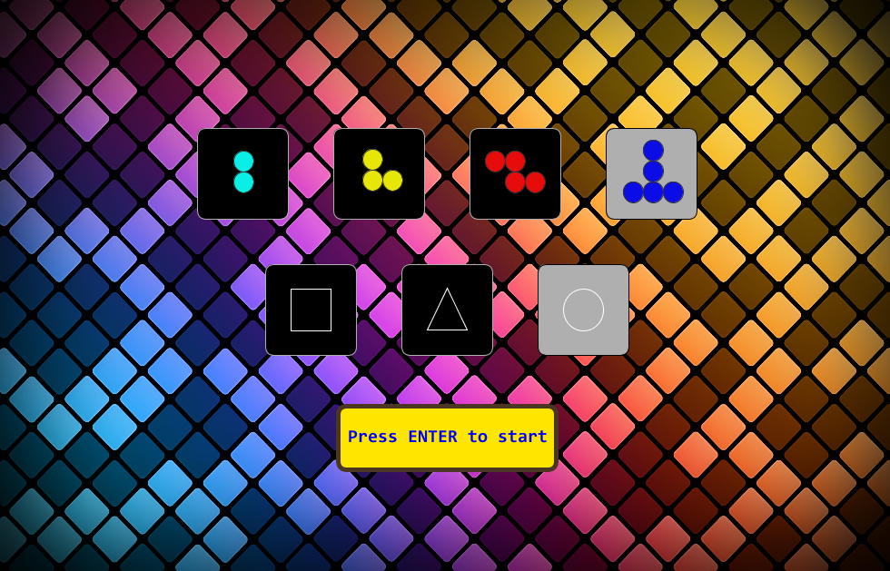
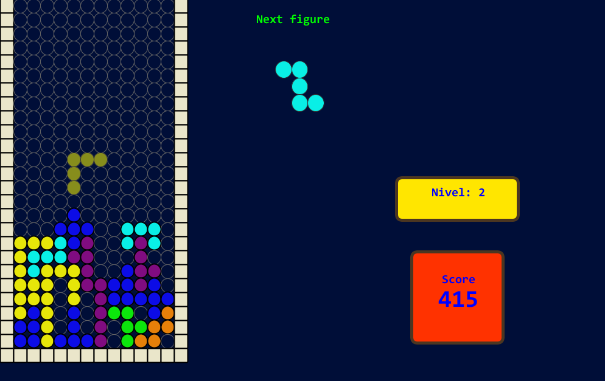
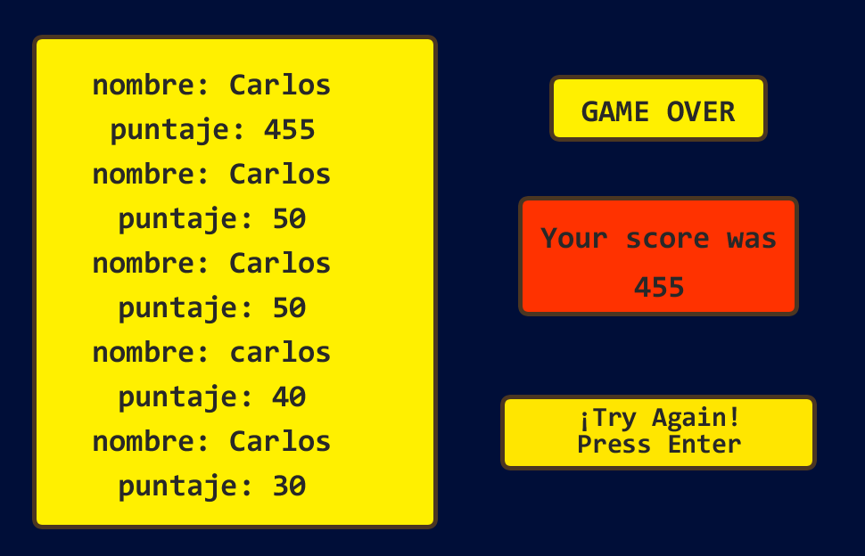

# :gem:TETRIS:gem:
-------------------------------------------------------------
Autor: Carlos Mario Jiménez Novoa. [cajimn](https://github.com/cajimn)

Universidad Nacional de Colombia

> ## Objetivo
El objetivo de este trabajo es mejorar el tetris realizado con solo programación estructurada y añadirle las respectivas clases que este necesite, modificando que ya no sólo se usen tetrominos, sino n-minos y además que no sólo vote cuadros sino otras figuras, de esta manera repasariamos los temas vistos en clase sobre la programación orientada a objetos.

-------------------------------------------------------------
> ## Cómo está hecho?

La base del juego fue el uso de bitwise para crear las figuras y verificar las colisiones, lo cual fue un método que agilizó la funcionalidad del tetris, además, el juego cuenta con un menú donde elegiras tu número de minos y el tipo de figura con el que quieres jugar, el juego contiene unos marcadores con los cuales podrás medir tu habilidad del juego, implementando niveles de acuerdo al puntaje que vayas adquiriendo, el cual qumenta la velocidad de caida del tetromino. Dichos marcadores quedaran guardados en un JSON, esto te permitirá ir mejorando tus puntajes cada vez que juegues. 

-------------------------------------------------------------

## Menú

> ## Contiene los cambios de minos y formas

## Juego

> ## se ve como se cambia el tablero según la forma y además el tamaño segun el mino elegido

## Gameover
> ## Acá podemos ver como se guardan los marcadores en el menú de gameover

## :hear_no_evil: instrucciones :hear_no_evil:

>  Primero te aparecerá un menú para que elijas un numero de minos y un tipo de figura

>  Luego deberás oprimir la tecla ENTER para empezar el juego 

  Te moverás de la siguiente manera:

  > - A la izquierda:arrow_backward: = LEFT:arrow_backward:
  > - A la derecha:arrow_forward: = RIGHT:arrow_forward:
  > - Hacia abajo:arrow_down_small: = DOWN:arrow_down_small:
  > - Bajar rápido:arrow_double_down: = SPACE
  > - Rotar la figura:arrows_counterclockwise: = UP:arrow_up_small:
  
>  Si quieres volver al menú pulsas la tecla 'p'

>  Si pierdes podrás ver tu puntaje final y tu posición respecto a los otros puntajes. 

>  Podrás reintentarlo y mejorar tu puntaje pulsando la tecla ENTER
--------------------------------------------------------------

